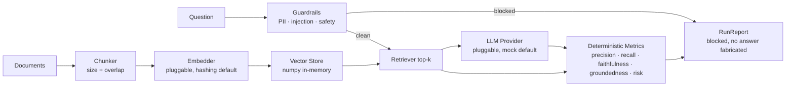

# raguard

**Evaluation-first RAG: every answer scored for retrieval accuracy, citation faithfulness, and hallucination risk — with guardrails for sensitive domains.**

Most RAG demos stop at "it answered the question." raguard starts there: it
wraps a retrieval-augmented generation pipeline in deterministic metrics that
run on **every** request with no external API calls, plus pre-generation
guardrails (PII screen, prompt-injection filter, sensitive-domain safety
checklist) for domains like mental health where a wrong answer is not just
embarrassing — it's harmful.



## Quickstart

Install the package directly from PyPI:

```bash
pip install raguard-svkmsr6
```

Runs fully offline — no API keys, no model downloads. To run the tests or examples, you can clone the repository:

```bash
git clone https://github.com/svkmsr6/raguard.git
cd raguard
pip install -e ".[dev]"
pytest                          # test suite (mock LLM/embedder only)
python examples/mental_health_demo.py   # end-to-end demo with guardrails
python evals/run_eval.py                # retrieval precision/recall on labelled set
```

A minimal programmatic run:

```python
from raguard import Raguard

pipeline = Raguard.from_documents([
    "Grounding techniques bring attention back to the present during anxiety.",
    "CBT is a structured talking therapy, usually weekly for 12 to 20 weeks.",
])
report = pipeline.run("What is grounding?", gold_chunk_ids=["doc-0::chunk-0::…"])
print(report.answer)
print(report.metrics)
```

Swap in real components by implementing three small ABCs — `Embedder`,
`VectorStore`, `LLMProvider` — and passing them to the pipeline. The mock
provider and hashing embedder exist so the evaluation harness itself is
testable.

## Metrics

All built-in metrics are deterministic: same input → same score, computed
from text and ids alone. That makes them free at request time, reproducible
in CI, and immune to provider-side drift. (Why no LLM-as-judge here:
[ADR 0002](docs/adr/0002-deterministic-metrics-before-llm-judges.md).)

| Metric | Definition | Why it matters |
| --- | --- | --- |
| `retrieval_precision` | `\|retrieved ∩ gold\| / \|retrieved\|` | Noise in context is where hallucinations breed. Precision measures how much of what you fed the generator was actually relevant. |
| `retrieval_recall` | `\|retrieved ∩ gold\| / \|gold\|` | A correct answer is impossible when the supporting evidence never reached the generator. Recall catches silent evidence gaps. |
| `citation_faithfulness` | Fraction of answer sentences whose content words are supported by the **cited** chunks | The difference between "cited sources" and "cited sources that back the claim." Low scores are the signature of citation drift and fabricated references. |
| `answer_groundedness` | Coverage of the answer's content words by the full retrieval set | Measures whether the answer drew on the retrieved context at all, versus the model free-styling from parametric memory. |
| `hallucination_risk` | `1 − (0.4·groundedness + 0.4·faithfulness + 0.2·precision)` | A triage composite so you can rank and alert on the riskiest runs first. A prioritisation aid, not a verdict. |

Custom metrics — including ragas adapters — plug in via the `Metric`
protocol: implement `name` and `score(EvalSlice) -> float`, then pass to
`Raguard(extra_metrics=[...])`.

## Guardrails

Guardrails run **before** generation; a blocked question short-circuits the
run and returns a report with `blocked=True` — the pipeline never fabricates
an answer it refused to guard.

- **PII screen** (`PIIDetector`) — regex/keyword detection of emails, phone
  numbers, SSNs, credit-card-like strings, IPs. Honest disclaimer: pattern
  PII detection has imperfect recall and non-trivial false positives. It's a
  tripwire that flags text for review, not a certification of cleanliness.
- **Prompt-injection filter** (`PromptInjectionFilter`) — pattern screen for
  instruction-override, system-role impersonation, delimiter escapes, and
  prompt exfiltration. Deterministic and explainable; bypassable by a
  determined attacker, so pair it with least-privilege prompt design.
- **Sensitive-domain checklist** (`SensitiveDomainGuard`, enabled via
  `GuardrailSuite(sensitive_mode=True)`) — crisis/self-harm signals,
  bias-prone overgeneralisation, and medication/diagnosis-seeking queries.
  In sensitive mode these escalate to BLOCK/WARN with explicit guidance
  instead of naive answers.

## Background

I spent the early part of my career building NLP systems where the hard part
was never the model — it was trusting what came out. My M.Sc. research at
Liverpool John Moores University ("Improving Mental Health Condition
Detection Using LLM and RAG") was where this got concrete: in a mental-health
setting, a fluent-but-unfounded answer isn't a quality problem, it's a safety
problem. That work — and later measuring what actually moves the needle on
NLP cost and quality at production scale — informed the two design choices
this repo exists to demonstrate: score every answer deterministically before
you ever reach for an LLM judge, and put the guardrails *inside* the
pipeline rather than around it as an afterthought. raguard is my reference
implementation of those ideas.

## Design decisions

- **Deterministic metrics before LLM judges.** Lexical-overlap metrics have
  known blind spots (paraphrase, implication), but they are free, exact, and
  reproducible — properties that matter more at the bottom of the stack.
  The `Metric` protocol is the seam where model-based judges plug in when
  you need them. [ADR 0002](docs/adr/0002-deterministic-metrics-before-llm-judges.md)
- **Pluggable embedders and stores.** The `Embedder`/`VectorStore` ABCs keep
  the core dependency-light and offline-runnable; the hashing embedder and
  numpy store are reference implementations of the contracts, not production
  choices. Chroma/pgvector adapters slot in behind the same interface.
  [ADR 0001](docs/adr/0001-pluggable-embedders-and-stores.md)
- **Guardrails gate generation, not just logs.** A BLOCKed question returns
  no answer at all. Observability without enforcement is decoration.
- **Honest heuristics.** Every detector states its recall limits in its
  docstring. A guardrail that overclaims is worse than no guardrail.
- **Deterministic chunk ids.** Chunk ids are content-derived, so citations
  and labelled eval sets stay stable across runs and machines.

## Repository layout

```
src/raguard/
  ingest.py      # document loading + chunking (size/overlap config)
  index.py       # VectorStore ABC + numpy in-memory cosine store + Embedder ABC
  retrieve.py    # retriever with rerank hook
  generate.py    # LLMProvider ABC + mock extractive provider
  evaluate.py    # Metric protocol + deterministic metrics
  guardrails.py  # PII, injection filter, sensitive-domain checklist
  pipeline.py    # Raguard.run orchestration → scored RunReport
examples/mental_health_demo.py   # offline demo, zero API keys
evals/eval_dataset.json          # labelled Q&A set with gold chunk ids
evals/run_eval.py                # retrieval precision/recall report
docs/hld.md, docs/lld.md         # high- and low-level design
docs/adr/                        # architecture decision records
tests/                           # pytest suite, fully offline
```

## What runs where

| Component | Offline (default) | Needs API keys / downloads |
| --- | --- | --- |
| Chunker, vector store, retriever | ✅ hashing embedder, numpy store | swap in sentence-transformers / Chroma via ABCs |
| Metrics | ✅ all deterministic | optional ragas via `Metric` protocol |
| Guardrails | ✅ all detectors | — |
| Generation | ✅ mock extractive provider | implement `LLMProvider` (e.g. OpenAI) |

## License

MIT — see [LICENSE](LICENSE).
