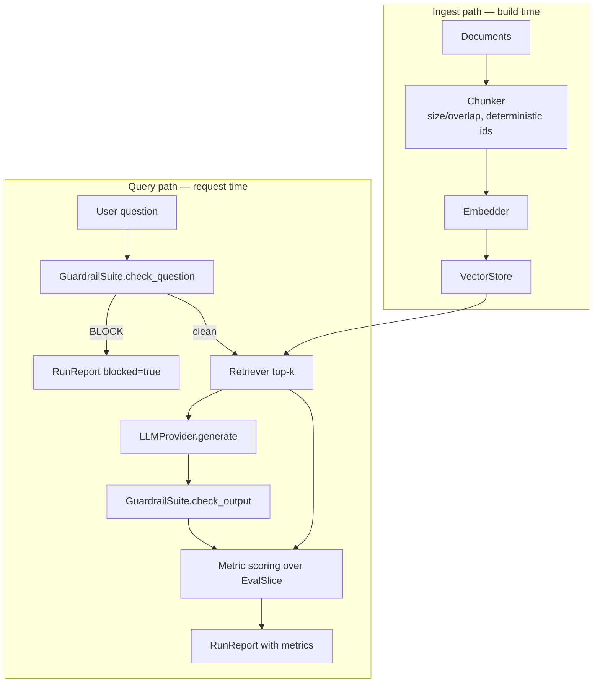
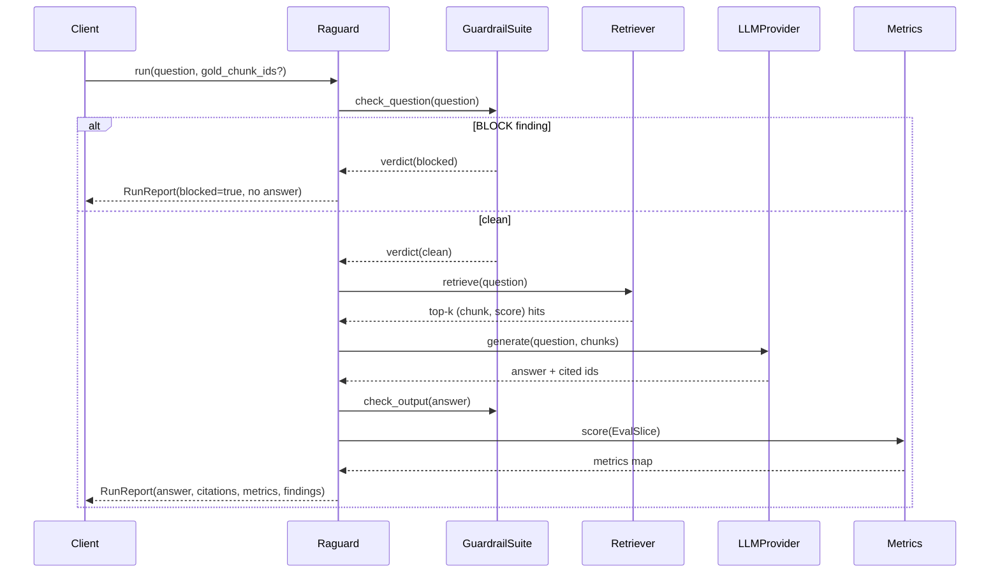

# raguard — High-Level Design

## 1. Purpose and scope

raguard is a retrieval-augmented generation (RAG) pipeline whose primary
product is not answers but **trust in answers**. Every run produces a
`RunReport` containing:

1. the answer and its cited chunk ids,
2. deterministic quality metrics (retrieval precision/recall, citation
   faithfulness, answer groundedness, hallucination-risk composite),
3. guardrail findings from pre-generation screening.

Scope: single-tenant, in-process library. Persistence, auth, multi-tenancy,
and serving are deliberately out of scope — this is the evaluation and
guardrail core you embed in a larger system.

## 2. System overview



Two paths share one index. The ingest path is batch; the query path is
request-time and allocates no model state (embeddings are computed
per-request through the `Embedder` interface).

## 3. Pipeline stages

| Stage | Module | Contract | Default impl | Extension point |
| --- | --- | --- | --- | --- |
| Chunking | `ingest.py` | `Chunker` dataclass | fixed size + overlap, sentence-aware split | configure sizes; subclass for semantic chunking |
| Embedding | `index.py` | `Embedder` ABC | `HashingEmbedder` (char 3-gram TF → L2-normalized) | sentence-transformers, OpenAI embeddings |
| Storage | `index.py` | `VectorStore` ABC | `NumpyVectorStore` (dense matrix, exact cosine) | Chroma, pgvector, FAISS |
| Retrieval | `retrieve.py` | `Retriever` | top-k cosine + optional `Reranker` hook | cross-encoder reranker |
| Guardrails | `guardrails.py` | `GuardrailSuite` | PII + injection (+ sensitive checklist) | custom detectors, extra regex sets |
| Generation | `generate.py` | `LLMProvider` ABC | `MockLLMProvider` (extractive, deterministic) | OpenAI, Anthropic, local models |
| Evaluation | `evaluate.py` | `Metric` protocol | 5 deterministic metrics | ragas adapter, LLM judges |

## 4. Metric definitions

Let `R` be retrieved chunk ids, `G` gold (labelled-relevant) chunk ids,
`C` cited chunk ids, `ans` the answer text, `cw(t)` the content-word set of
`t` (lowercased alphanumeric tokens, stopwords removed, len > 2), and
`sent(ans)` the answer split into sentences.

### 4.1 Retrieval precision

```
precision = |R ∩ G| / |R|        (0 if R empty; NaN if G unlabelled)
```

Measures signal density in the generator's context. Low precision → the
model must separate evidence from noise; noise is the raw material of
hallucination.

### 4.2 Retrieval recall

```
recall = |R ∩ G| / |G|           (NaN if G unlabelled)
```

Measures evidence completeness. Recall < 1 means the correct answer may be
unanswerable from context; a confident answer in that state is a red flag
regardless of fluency.

### 4.3 Citation faithfulness

For each sentence `s ∈ sent(ans)`:

```
supported(s) = |cw(s) ∩ ∪cw(cited chunks)| / |cw(s)| ≥ 0.5
faithfulness = |{s : supported(s)}| / |sent(ans)|
```

Special case: an answer citing nothing scores 1.0 only if it is a refusal
("do not have enough…"), else 0.0. This encodes the policy: **a refusal is
a correct answer to an unanswerable question; an uncited claim is not.**

### 4.4 Answer groundedness

```
groundedness = |cw(ans) ∩ ∪cw(all retrieved chunks)| / |cw(ans)|
```

Groundedness over the full retrieval set, unlike faithfulness which checks
only cited chunks. Divergence between the two (faithful but ungrounded, or
grounded but unfaithful) localises the failure: citation selection vs.
generation.

### 4.5 Hallucination-risk composite

```
risk = 1 − (0.4·groundedness + 0.4·faithfulness + 0.2·precision)
```

Weights reflect failure-mode analysis (§6): ungrounded or unfaithful
answers are direct risk; retrieval noise is a contributing cause. Weights
renormalise when gold labels are absent. The composite exists for
**triage** — ranking runs for review — never as a pass/fail verdict.

## 5. Guardrail design

Guardrails are **pre-generation gates** with three severity levels
(INFO/WARN/BLOCK). A BLOCK short-circuits the run: `RunReport.blocked=true`,
empty answer, no fabricated content.

| Detector | Type | Honest limits |
| --- | --- | --- |
| `PIIDetector` | regex + keyword | Recall < 100%: misses obfuscation and novel formats; FPs on synthetic identifiers. Tripwire, not certification. |
| `PromptInjectionFilter` | word-boundary patterns | Deterministic and auditable; a determined attacker can bypass. Pair with least-privilege prompts, tool allow-lists. |
| `SensitiveDomainGuard` | checklist of crisis/bias/medical-advice signals | Pattern-based crisis detection errs toward WARN; production systems must route to human review. |

Sensitive mode (`sensitive_mode=True`) adds the checklist to question and
output screening. This mode exists because of where the design work started
(see README → Background): in mental-health-adjacent domains the cost
asymmetry between a blocked good question and an answered harmful one is
extreme.

## 6. Failure modes and how the design responds

| Failure mode | Root cause | Detection | Response |
| --- | --- | --- | --- |
| **Hallucination** (fluent, ungrounded claim) | weak retrieval; model prior dominates | low `answer_groundedness` | flag via `hallucination_risk`; retrieval improvement loop via `evals/` |
| **Citation drift** (cited source doesn't support claim) | generator decorates answers with plausible-but-unrelated citations | low `citation_faithfulness` | BLOCK-level signal in sensitive mode; per-citation audit trail |
| **Fabricated citation** (cited id not retrieved / refusal violated) | degenerate generator behaviour | faithfulness = 0 for uncited claims | treat as hard failure in CI evals |
| **Prompt injection** | malicious question overrides system prompt | `PromptInjectionFilter` BLOCK | refuse before retrieval; log attempt |
| **PII leakage** | personal data flows through context into answers | `PIIDetector` on question and output | WARN/BLOCK + review queue |
| **Crisis mishandling** (bot improvises therapy / misses self-harm signal) | domain naivety | `SensitiveDomainGuard` crisis rule | BLOCK; surface vetted crisis resources (production integration point) |
| **Retrieval evidence gap** (gold chunk never surfaced) | embedding/index mismatch | low `retrieval_recall` in evals | block deploy if eval recall regresses |
| **Metric gaming by provider swap** | scores drift when embeddings change | deterministic ids; evals pinned to dataset version | re-run `evals/run_eval.py` on any component swap |

## 7. Sequence: a guarded run



## 8. Operational characteristics

- **Latency**: metrics add O(answer + context) string ops — negligible next
  to embedding/LLM calls. Deterministic metrics are essentially free.
- **Cost**: zero marginal cost — no judge model calls in the hot path.
- **Reproducibility**: hashing embedder + mock provider make CI runs
  byte-for-byte reproducible; real components swap behind ABCs without
  touching pipeline code.
- **Capacity**: `NumpyVectorStore` is O(n) memory, O(n·k) search — fine to
  ~100k chunks; beyond that, drop in a real ANN index behind `VectorStore`.
